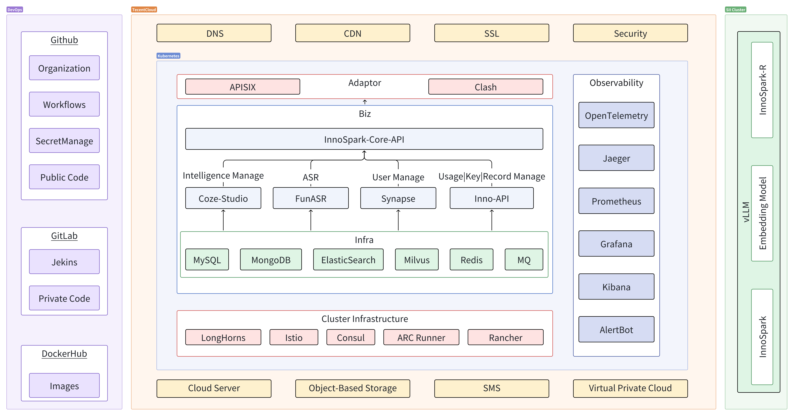

# InnoSpark-Core-API

[启创·InnoSpark](https://innospark.xhpolaris.com/chat/690bf407e2a01e1c72de2cf9) 的后端服务，包括上下文管理、附件解析、长期记忆、违禁词拦截等一系列功能。

## 🏗️ 系统架构

## ⚙️ 技术栈

| 类别     | 使用技术           |
|--------|----------------|
| **语言** | Go 1.24        |
| **框架** | Hertz, Eino    |
| **数据** | MongoDB, Redis |
---